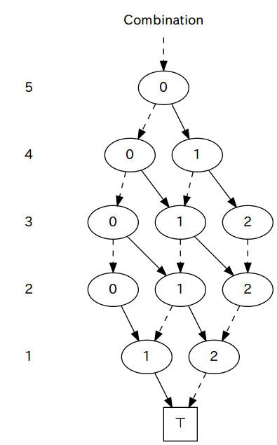

TdZdd
===========================================================================

### A top-down/breadth-first decision diagram manipulation framework

TdZdd is a C++ library for manipulating ordered decision diagrams (DDs)
efficiently with following basic functions.

* Top-down/breadth-first DD construction
* Reduction as BDDs/ZDDs
* Dump in a Graphviz (dot) format
* Bottom-up/breadth-first DD evaluation

The DD construction function takes user's class object as an argument,
which is a specification of the DD structure to be constructed.
An argument of the DD evaluation function represents return data type and
the procedure to be executed at each DD node.
The construction and evaluation functions can also be used to implement
import and export functions of DD structures from/to standard BDD packages.

Other features include:

* Support of *N*-ary (binary, ternary, quaternary, ...) DDs
* Parallel processing with OpenMP
* Header-only C++ library; no need for installation
* Distributed with sample applications

This software is released under the MIT License, see [LICENSE](LICENSE).

### Contents

* [Overview](#overview)
* [DD specifications](#dd-specifications)
* [See also](#see-also)


Overview
---------------------------------------------------------------------------

A DD has one root node and two terminal nodes (``⊤`` and ``⊥``).
Every non-terminal node of an *N*-ary DD has *N* outgoing edges.



The above picture shows an example of binary DD structure,
where the ``⊥`` terminal node and all edges to it are omitted for visibility;
dashed and solid lines are 0- and 1-edges respectively.
The DD represents a set of all 3-combinations out of 5 items.
Note that levels of DD nodes are defined in descending order;
the root node has the highest level (5) and the terminal nodes have level 0.

The following code from [apps/test/example1.cpp](apps/test/example1.cpp)
is a *DD specification* of a binary DD structure representing a set of all
*k*-combinations out of *n* items.

```cpp
#include <tdzdd/DdSpec.hpp>

class Combination: public tdzdd::ScalarDdSpec<Combination,int,2> {
    int const n;
    int const k;

public:
    Combination(int n, int k)
            : n(n), k(k) {
    }

    int getRoot(int& state) const {
        state = 0;
        return n;
    }

    int getChild(int& state, int level, int value) const {
        state += value;
        if (--level == 0) return (state == k) ? -1 : 0;
        if (state > k) return 0;
        if (state + level < k) return 0;
        return level;
    }
};
```

Class `Combination` extends `tdzdd::ScalarDdSpec<Combination,int,2>`,
of which the first template parameter is the derived class itself,
the second one is the type of its *state*,
and the third one declares the out-degree of non-terminal DD nodes (*N*).
The class contains public member functions `int getRoot(int& state)`
and `int getChild(int& state, int level, int value)`.

`getRoot` initializes the `state` argument by the state of the root node
and returns its level.
`getChild` receives `state` and `level` of a non-terminal node
and integer `value` from 0 to *N*-1 representing one of the branches.
It computes the state and the level of the child node.
If the child node is not a terminal, it updates `state` and returns the level.
If the child node is a ``⊥`` or ``⊤`` terminal, it returns 0 or -1 respectively;
`state` is not used in those cases.

A DD represented by a DD specification can be dumped in "dot" format
for [Graphviz](http://www.graphviz.org/) visualization tools:

```cpp
Combination spec(5, 2);
spec.dumpDot(std::cout);
```

`tdzdd::DdStructure<2>` is a class of explicit binary DD structures.
We can construct its object from a DD specification object:

```cpp
// #include <tdzdd/DdStructure.hpp>
tdzdd::DdStructure<2> dd(spec);
```

A DD structrue can be reduced as a BDD or ZDD using its
`void bddReduce()` or `void zddReduce()` member function,
and also can be dumped in "dot" format:

```cpp
dd.zddReduce();
dd.dumpDot(std::cout);
```


DD specifications
---------------------------------------------------------------------------

### DdSpec

[`tdzdd::DdSpec<S,ARITY>`](include/tdzdd/DdSpec.hpp) is the base class of
all types of DD specifications.
It defines utility member functions such as `dumpDot`.

### StatelessDdSpec

### ScalarDdSpec

### PodArrayDdSpec

### ArrayDdSpec

### PodHybridDdSpec

See also
---------------------------------------------------------------------------

* [Graphillion](http://graphillion.org): a Python library using TdZdd.
